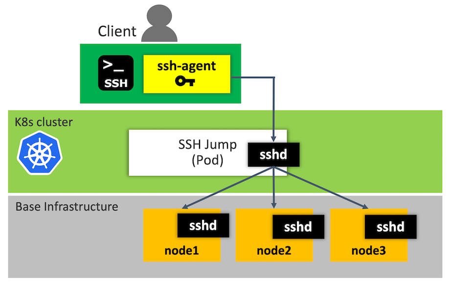

# kubectl-plugin-ssh-jumphost

A kubectl plugin to SSH into Kubernetes nodes using a SSH jump host Pod

A `jump host` Pod is an intermediary Pod or an SSH gateway to Kubernetes node machines, through which a connection can be made to the node machines.

Here is an scenario that you can achive with this plugin where you want to connect to Kubernetes node, but you have to go through a jump host Pod, because of firewalling, routing and access privileges. There is a number of valid reasons why the jump hosts are needed..



> [NOTE]
> - Kubectl versions >= `1.12.0` (Preferred)
>   - As of Kubernetes 1.12, kubectl now allows adding external executables as subcommands. For more detail, see [Extend kubectl with plugins](https://kubernetes.io/docs/tasks/extend-kubectl/kubectl-plugins/)
>   - You can run the pluin with `kubectl ssh ...`
> - Kubectl versions < `1.12.0`
>   - You still can run the plugin directly with `kubectl-ssh ...`


## Installation

Install the plugin by copying the script in the $PATH of your shell.

```sh
# Get source
$ git clone https://github.com/yokawasa/kubectl-plugin-ssh-jumphost.git
$ cd kubectl-plugin-ssh-jumphost
# Add kubeclt-ssh to the install path.
$ sudo cp kubectl-ssh /usr/local/bin
```

Once in the $PATH, run:
```sh
$ kubectl plugin list

The following kubectl-compatible plugins are available:
/usr/local/bin/kubectl-ssh

$ kubectl ssh
```

## How to use

### Usage

```TXT
Usage:
  kubectl ssh <dest_node> [options]

Options:
  <dest_node>                     Destination node IP
  -u, --user <sshuser>            SSH User name
  -i, --identity <identity_file>  Identity key file
  -p, --pubkey <pub_key_file>     Public key file
  --skip-agent                    Skip automatically starting SSH agent and adding
                                  SSH Identity key into the agent before SSH login
                                  (=> You need to manage SSH agent by yourself)
  --cleanup-agent                 Clearning up SSH agent at the end
                                  The agent is NOT cleaned up in case that 
                                  --skip-agent option is given
  --cleanup-jump                  Clearning up sshjump pod at the end
                                  Default: Skip cleaning up sshjump pod
  -h, --help                      Show this message
```

#### Option parameters Cache
`username`, `identity`, `pubkey` options are cached, therefore you can omit these options afterward. The options are stored in a file named `$HOME/.kube/kubectlssh/options`
```
$ cat $HOME/.kube/kubectlssh/options
sshuser=azureuser
identity=/Users/yokawasa/.ssh/id_rsa_k8s
pubkey=/Users/yokawasa/.ssh/id_rsa_k8s.pub
```

#### SSH Agent (ssh-agent)

The plugin automatically check if there are any `ssh-agents` started running by the plugin, and if `ssh-agent` not found, the plugin starts `ssh-agent` and adds SSH Identity key into the agent before SSH login. If the command find that ssh-agent is already running, it doesn't start a new agent, and re-use the agent.
You can kill the created agent with `--cleanup-agent` at the end of command.

In addtion, you can skip starting `ssh-agent` by giving `--skip-agent`. This is actually a case where you already have ssh-agent managed.

### Examples

Show all node list. Simply executing `kubectl ssh` gives you the list of destination nodes as well as command usage

```sh 
$ kubectl ssh

Usage:
  kubectl ssh <dest_node> [options]

Options:
  <dest_node>                     Destination node IP
  -u, --user <sshuser>            SSH User name
  -i, --identity <identity_file>  Identity key file
  -p, --pubkey <pub_key_file>     Public key file
  --skip-agent                    Skip automatically starting SSH agent and adding
                                  SSH Identity key into the agent before SSH login
                                  (=> You need to manage SSH agent by yourself)
  --cleanup-agent                 Clearning up SSH agent at the end
                                  The agent is NOT cleaned up in case that
                                  --skip-agent option is given
  --cleanup-jump                  Clearning up sshjump pod at the end
                                  Default: Skip cleaning up sshjump pod
  -h, --help                      Show this message

Example:
   ....

List of destination node...
Hostname
aks-nodepool1-18558189-0
aks-nodepool1-18558189-1
aks-nodepool1-18558189-2
```

Then, SSH into a node `aks-nodepool1-18558189-0` with options like:
- usernaem: `azureuser`
- identity:`~/.ssh/id_rsa_k8s`
- pubkey:`~/.ssh/id_rsa_k8s.pub`)
```sh
$ kubectl ssh aks-nodepool1-18558189-0 \
  -u azureuser -i ~/.ssh/id_rsa_k8s -p ~/.ssh/id_rsa_k8s.pub
```

As explained in usage secion, `username`, `identity`, `pubkey` options are cached, therefore you can omit these options afterward.

```sh
$ kubectl ssh aks-nodepool1-18558189-0
```

You can pass the commands to run in the destination node like this (Suppose that `username`, `identity`, `pubkey` options are cached):
```sh
echo "uname -a" | kubectl ssh aks-nodepool1-18558189-0

(Output)
Linux aks-nodepool1-18558189-0 4.15.0-1035-azure #36~16.04.1-Ubuntu SMP Fri Nov 30 15:25:49 UTC 2018 x86_64 x86_64 x86_64 GNU/Linux
```


You can clean up sshjump pod at the end of the command with `--cleanup-jump` option, otherwise, the sshjump pod stay running by default.
```sh
$ kubectl ssh aks-nodepool1-18558189-0 \
  -u azureuser -i ~/.ssh/id_rsa_k8s -p ~/.ssh/id_rsa_k8s.pub \
  --cleanup-jump
```

You can clean up ssh-agent at the end of the command with `--cleanup-agent` option, otherwise, the ssh-agent process stay running once it's started.
```sh
$ kubectl ssh aks-nodepool1-18558189-0 \
  -u azureuser -i ~/.ssh/id_rsa_k8s -p ~/.ssh/id_rsa_k8s.pub \
  --cleanup-agent
```
You can skip starting `ssh-agent` by giving `--skip-agent`. This is actually a case where you already have ssh-agent managed. Or you can start new ssh-agent and add an identity key to the ssh-agent like this:

```sh
# Start ssh-agent manually
$ eval `ssh-agent`
# Add an arbitrary private key, give the path of the key file as an argument to ssh-add
$ ssh-add ~/.ssh/id_rsa_k8s
# Then, run the plugin with --skip-agent
$ kubectl ssh aks-nodepool1-18558189-0 \
  -u azureuser -i ~/.ssh/id_rsa_k8s -p ~/.ssh/id_rsa_k8s.pub \
  --skip-agent

# At the end, run this if you want to kill the current agent
$ ssh-agent -k
```

## Contributing

Bug reports and pull requests are welcome on GitHub at https://github.com/yokawasa/kubectl-plugin-ssh-jumphost