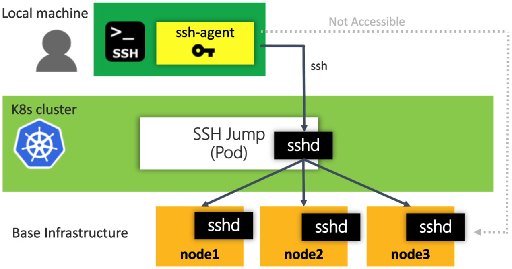
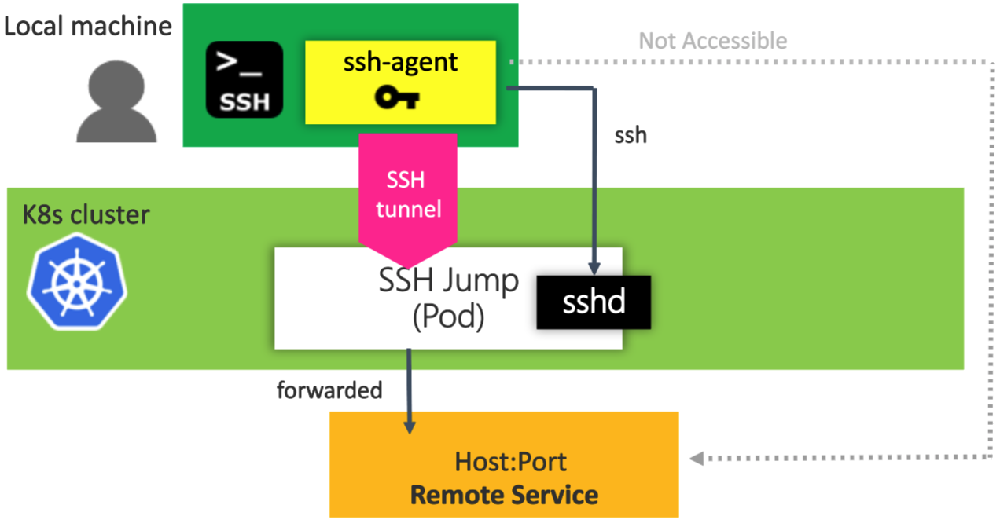

# kubectl-plugin-ssh-jump

[](https://github.com/topics/kubectl-plugin)

A kubectl plugin to access Kubernetes nodes or remote services using a SSH jump Pod

A `jump host` Pod is an intermediary Pod or an SSH gateway to Kubernetes node machines, through which a connection can be made to the node machines or remote services.

Here is an scenario where you want to connect to Kubernetes nodes or remote services, but you have to go through a jump host Pod, because of firewalling, access privileges. etc. There is a number of valid reasons why the jump hosts are needed...

**CASE 1: SSH into Kubernetes nodes via SSH jump Pod**


**CASE 2: Connect to remote serivces via SSH local port forwarding**. SSH local port forwarding allows to forward the traffic form local machine to SSH jump then SSH jump will forward the traffic to remote services (host:port)s. 


> [NOTE]
> - Kubectl versions >= `1.12.0` (Preferred)
>   - As of Kubernetes 1.12, kubectl now allows adding external executables as subcommands. For more detail, see [Extend kubectl with plugins](https://kubernetes.io/docs/tasks/extend-kubectl/kubectl-plugins/)
>   - You can run the pluin with `kubectl ssh-jump ...`
> - Kubectl versions < `1.12.0`
>   - You still can run the plugin directly with `kubectl-ssh-jump ...`


**Table of Content**
<!-- TOC -->

- [kubectl-plugin-ssh-jump](#kubectl-plugin-ssh-jump)
	- [Pre-requistes](#pre-requistes)
	- [Installation](#installation)
		- [Install through krew](#install-through-krew)
		- [Manual Installation](#manual-installation)
	- [How to use](#how-to-use)
		- [Usage](#usage)
			- [Option parameters Cache](#option-parameters-cache)
			- [SSH Agent (ssh-agent)](#ssh-agent-ssh-agent)
		- [Examples](#examples)
			- [CASE 1: SSH into Kubernetes nodes via SSH jump Pod](#case-1-ssh-into-kubernetes-nodes-via-ssh-jump-pod)
				- [1-1 - You have private & public SSH key on your side](#1-1---you-have-private--public-ssh-key-on-your-side)
				- [1-2 - You have .pem file but you don't have public key on your side](#1-2---you-have-pem-file-but-you-dont-have-public-key-on-your-side)
			- [CASE 2: Access remote serivces via SSH local port forwarding](#case-2-access-remote-serivces-via-ssh-local-port-forwarding)
				- [2-1 - Configuring SSH local port forwarding with --args or -a option](#2-1---configuring-ssh-local-port-forwarding-with---args-or--a-option)
	- [Useful Links](#useful-links)
	- [Contributing](#contributing)

<!-- /TOC -->


## Pre-requistes
This plugin needs the following programs:
* ssh(1)	
* ssh-agent(1)
* ssh-keygen(1)

## Installation

### Install through krew
This is a way to install kubectl-ssh-jump through [krew](https://krew.sigs.k8s.io/). After installing krew by following [this](https://krew.sigs.k8s.io/docs/user-guide/setup/install/), you can install kubectl-ssh-jump like this:

```sh
$ kubectl krew install ssh-jump
```

Expected output would be like this:
```
Updated the local copy of plugin index.
Installing plugin: ssh-jump
CAVEATS:
\
 |  This plugin needs the following programs:
 |  * ssh(1)
 |  * ssh-agent(1)
 |
 |  Please follow the documentation: https://github.com/yokawasa/kubectl-plugin-ssh-jump
/
Installed plugin: ssh-jump
```

Once it's installed, run:
```sh
$ kubectl plugin list

The following kubectl-compatible plugins are available:

/Users/yoichi.kawasaki/.krew/bin/kubectl-krew
/Users/yoichi.kawasaki/.krew/bin/kubectl-ssh_jump

$ kubectl ssh-jump
```

### Manual Installation

Install the plugin by copying the script in the $PATH of your shell.

```sh
# Get source
$ git clone https://github.com/yokawasa/kubectl-plugin-ssh-jump.git
$ cd kubectl-plugin-ssh-jump
$ chmod +x kubectl-ssh-jump
# Add kubeclt-ssh-jump to the install path.
$ sudo cp -p kubectl-ssh-jump /usr/local/bin
```

Once in the $PATH, run:
```sh
$ kubectl plugin list

The following kubectl-compatible plugins are available:
/usr/local/bin/kubectl-ssh-jump

$ kubectl ssh-jump
```

## How to use

### Usage

```TXT
Usage: 
  kubectl ssh-jump <dest_node> [options]

Options:
  <dest_node>                     Destination node name or IP address
                                  dest_node must start from the following letters:
                                  ASCII letters 'a' through 'z' or 'A' through 'Z',
                                  the digits '0' through '9', or hyphen ('-').
                                  NOTE: Setting dest_node as 'jumphost' allows to 
                                  ssh into SSH jump Pod as 'root' user 
  -u, --user <sshuser>            SSH User name
  -i, --identity <identity_file>  Identity key file, or PEM(Privacy Enhanced Mail)
  -p, --pubkey <pub_key_file>     Public key file
  -P, --port <port>               SSH port for target node SSH server
                                  Defaults to 22
  -a, --args <args>               Args to exec in ssh session
  --skip-agent                    Skip automatically starting SSH agent and adding 
                                  SSH Identity key into the agent before SSH login
                                  (=> You need to manage SSH agent by yourself)
  --cleanup-agent                 Clearning up SSH agent at the end
                                  The agent is NOT cleaned up in case that
                                  --skip-agent option is given
  --cleanup-jump                  Clearning up sshjump pod at the end
                                  Defaults to skip cleaning up sshjump pod
  -h, --help                      Show this message

Example:
  Scenario1 - You have private & public SSH key on your side
  $ kubectl ssh-jump -u myuser -i ~/.ssh/id_rsa -p ~/.ssh/id_rsa.pub hostname

  Scenario2 - You have .pem file but you don't have public key on your side
  $ kubectl ssh-jump -u ec2-user -i ~/.ssh/mykey.pem hostname
```

#### Option parameters Cache

`username`, `identity`, `pubkey`, `port` options are cached, therefore you can omit these options afterward. The options are stored in a file named `$HOME/.kube/kubectlssh/options`

```sh
$ cat $HOME/.kube/kubectlssh/options
sshuser=myuser
identity=/Users/yoichi.kawasaki/.ssh/id_rsa_k8s
pubkey=/Users/yoichi.kawasaki/.ssh/id_rsa_k8s.pub
port=22
```

#### SSH Agent (ssh-agent)

The plugin automatically check if there are any `ssh-agents` started running by the plugin, and starts `ssh-agent`if it doesn't find any `ssh-agent` running and adds SSH Identity key into the agent before SSH login. If the command find that ssh-agent is already running, it doesn't start a new agent, and re-use the agent.
Add `--cleanup-agent` option if you want to kill the created agent at the end of command.

In addtion, add `--skip-agent` option if you want to skip automatic starting `ssh-agent`. This is actually a case where you already have ssh-agent managed or you want to manually start the agent.

### Customize SSH jump pod

You can customize the sshjump pod created by `kubectl ssh-jump` by setting the `$SSH_JUMP_POD_TEMPLATE` environment variable to the path to a pod template on disk.

However, customized sshjump pods must be named `sshjump` and run in the current namespace or `kubectl ssh-jump` won't be able to find them.

### Examples

Show all node list. Simply executing `kubectl ssh-jump` gives you the list of destination nodes as well as command usage

```sh
$ kubectl ssh-jump

Usage: 
  kubectl ssh-jump <dest_node> [options]

Options:
  <dest_node>                     Destination node name or IP address
                                  dest_node must start from the following letters:
                                  ASCII letters 'a' through 'z' or 'A' through 'Z',
                                  the digits '0' through '9', or hyphen ('-').
                                  NOTE: Setting dest_node as 'jumphost' allows to 
                                  ssh into SSH jump Pod as 'root' user 
  -u, --user <sshuser>            SSH User name
  -i, --identity <identity_file>  Identity key file, or PEM(Privacy Enhanced Mail)
  -p, --pubkey <pub_key_file>     Public key file
  -P, --port <port>               SSH port for target node SSH server
                                  Defaults to 22
  -a, --args <args>               Args to exec in ssh session
  --skip-agent                    Skip automatically starting SSH agent and adding 
                                  SSH Identity key into the agent before SSH login
                                  (=> You need to manage SSH agent by yourself)
  --cleanup-agent                 Clearning up SSH agent at the end
                                  The agent is NOT cleaned up in case that
                                  --skip-agent option is given
  --cleanup-jump                  Clearning up sshjump pod at the end
                                  Defaults to skip cleaning up sshjump pod
  -h, --help                      Show this message

Example:
  Scenario1 - You have private & public SSH key on your side
  $ kubectl ssh-jump -u myuser -i ~/.ssh/id_rsa -p ~/.ssh/id_rsa.pub hostname

  Scenario2 - You have .pem file but you don't have public key on your side
  $ kubectl ssh-jump -u ec2-user -i ~/.ssh/mykey.pem hostname

  Scenario3 - You want to use a custom sshjump pod definition
  $ kubectl ssh-jump -u ec2-user -i ~/.ssh/mykey.pem --pod-template ~/myjumppod.yaml hostname

List of destination node...
Hostname                    Internal-IP
aks-nodepool1-18558189-0    10.240.0.4
...

```


#### CASE 1: SSH into Kubernetes nodes via SSH jump Pod

##### 1-1 - You have private & public SSH key on your side

Suppose you have private & public SSH key on your side and you want to SSH to a node named `aks-nodepool1-18558189-0`, execute the plugin with options like this:

- usernaem: `myuser`
- identity:`~/.ssh/id_rsa_k8s`
- pubkey:`~/.ssh/id_rsa_k8s.pub`)

```sh
$ kubectl ssh-jump aks-nodepool1-18558189-0 \
  -u myuser -i ~/.ssh/id_rsa_k8s -p ~/.ssh/id_rsa_k8s.pub
```

> [NOTE] you can try SSH into a node using node IP address (`Internal-IP`) instead of `Hostname`

As explained in usage secion, `username`, `identity`, `pubkey` options will be cached, therefore you can omit these options afterward.

```sh
$ kubectl ssh-jump aks-nodepool1-18558189-0
```

You can pass the commands to run in the destination node like this (Suppose that `username`, `identity`, `pubkey` options are cached):
```sh
echo "uname -a" | kubectl ssh-jump aks-nodepool1-18558189-0

(Output)
Linux aks-nodepool1-18558189-0 4.15.0-1035-azure #36~16.04.1-Ubuntu SMP Fri Nov 30 15:25:49 UTC 2018 x86_64 x86_64 x86_64 GNU/Linux
```

You can pass commands with `--args` or `-a` option
``` sh
kubectl ssh-jump aks-nodepool1-18558189-0 --args "uname -a"

(Output)
Linux aks-nodepool1-18558189-0 4.15.0-1035-azure #36~16.04.1-Ubuntu SMP Fri Nov 30 15:25:49 UTC 2018 x86_64 x86_64 x86_64 GNU/Linux
```

You can clean up sshjump pod at the end of the command with `--cleanup-jump` option, otherwise, the sshjump pod stay running by default.

```sh
$ kubectl ssh-jump aks-nodepool1-18558189-0 \
  -u myuser -i ~/.ssh/id_rsa_k8s -p ~/.ssh/id_rsa_k8s.pub \
  --cleanup-jump
```

You can clean up ssh-agent at the end of the command with `--cleanup-agent` option, otherwise, the ssh-agent process stay running once it's started.

```sh
$ kubectl ssh-jump aks-nodepool1-18558189-0 \
  -u myuser -i ~/.ssh/id_rsa_k8s -p ~/.ssh/id_rsa_k8s.pub \
  --cleanup-agent
```

You can skip starting `ssh-agent` by giving `--skip-agent`. This is actually a case where you already have ssh-agent managed. Or you can start new ssh-agent and add an identity key to the ssh-agent like this:

```sh
# Start ssh-agent manually
$ eval `ssh-agent`
# Add an arbitrary private key, give the path of the key file as an argument to ssh-add
$ ssh-add ~/.ssh/id_rsa_k8s
# Then, run the plugin with --skip-agent
$ kubectl ssh-jump aks-nodepool1-18558189-0 \
  -u myuser -i ~/.ssh/id_rsa_k8s -p ~/.ssh/id_rsa_k8s.pub \
  --skip-agent

# At the end, run this if you want to kill the current agent
$ ssh-agent -k
```

##### 1-2 - You have .pem file but you don't have public key on your side

From v0.4.0, the plugin supports PEM (Privacy Enhanced Mail) scenario where you create key-pair but you only have .pem / private key (downloaded from AWS, for example) and you don't have the public key on your side.

Suppose you've already downloaded a pem file and you want to ssh to your EKS worker node (EC2) named `ip-10-173-62-96.ap-northeast-1.compute.internal` using the pem, execute the plugin with options like this:

- usernaem: `ec2-user`
- identity: `~/.ssh/mykey.pem`

```sh
$ kubectl ssh-jump -u ec2-user -i ~/.ssh/mykey.pem ip-10-173-62-96.ap-northeast-1.compute.internal
```
#### CASE 2: Access remote serivces via SSH local port forwarding

SSH local port forwarding allows to forward the traffic form local machine to SSH jump then SSH jump will forward the traffic to remote services (host:port)s.
##### 2-1 - Configuring SSH local port forwarding with --args or -a option

Suppose you have private & public SSH key on your side and you want to access a remote server (IP: `10.100.10.8`) using `3389`/TCP port which is not accessible directly but accessible via SSH jump, execute the plugin with options like this, at first:

- identity:`~/.ssh/id_rsa_k8s`
- pubkey:`~/.ssh/id_rsa_k8s.pub`)

 The command below allows to forward the traffic form local machine (`localhost:13200`) to SSH jump then SSH jump will forward the traffic to the remote server (`10.100.10.8:3389`). 
```sh
$ kubectl ssh-jump sshjump \
  -i ~/.ssh/id_rsa_k8s -p ~/.ssh/id_rsa_k8s.pub \
  -a "-L 13200:10.100.10.8:3389"
```
> - `sshjump` is the hostname for SSH jump Pod
> -  The value for `--arg` or `-a` should be in this format: "-L local_port:remote_address:remote_port"

Now, you're ready to access to the remote server at port 13200 at local machine.

## Useful Links

- [Extend kubectl with plugins](https://kubernetes.io/docs/tasks/extend-kubectl/kubectl-plugins/)
- [Write your own kubectl subcommands](https://ahmet.im/blog/kubectl-plugins/)
- [SSH-AGENT - SINGLE SIGN-ON USING SSH](https://www.ssh.com/ssh/agent)

## Contributing

Bug reports and pull requests are welcome on GitHub at https://github.com/yokawasa/kubectl-plugin-ssh-jump
